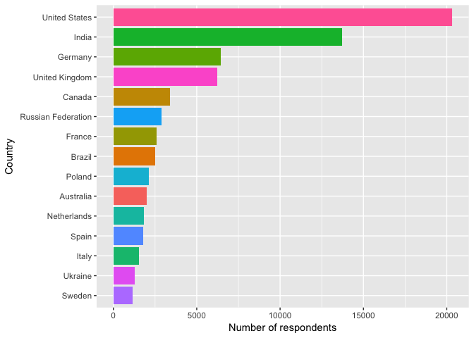
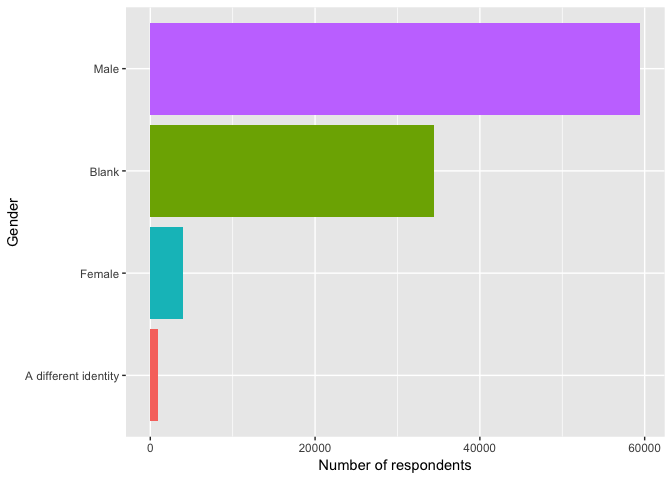
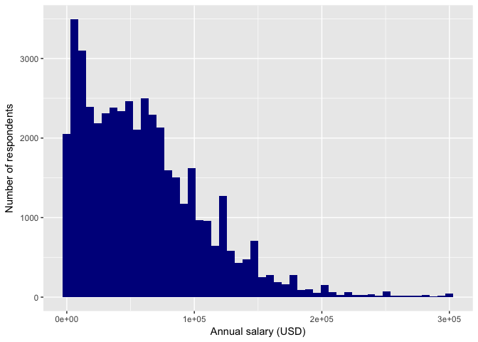
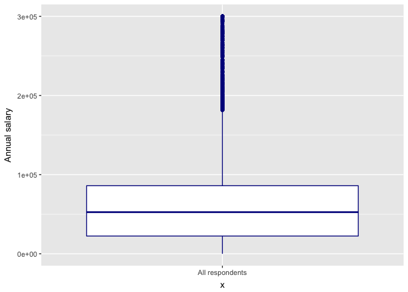
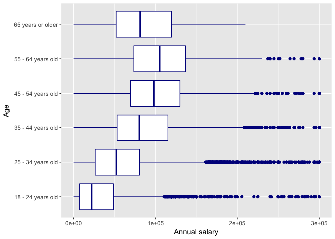

I have created this data analysis notebook to help me learn about R, the data.table package, the ggplot2 package, and xgboost. The **dataset** that I will be exploring is the responses to the 2018 Stack Overflow Developer Survey, which can be found [here][data]. Other resources/references can be found at the [end](#references) of this notebook. 

Note: the survey dataset is _not_ included in this GitHub repository.

## Libraries

```r
library(magrittr)
library(ggplot2)
library(data.table)
```

## Data

```r
dt <- fread("data/survey_results_public.csv")
```


```r
num_respondents <- dim(dt)[1]
num_vars <- dim(dt)[2]
paste("total number of respondents:", num_respondents)
```

```
## [1] "total number of respondents: 98855"
```

```r
paste("total number of variables:", num_vars)
```

```
## [1] "total number of variables: 129"
```

### Visualization
In this section, I will 1. use data.table to fetch interesting data and 2. use ggplot to display that data.

Top 15 countries:

```r
# count respondents, grouped by each country, sorted in descending order
countries_sorted <- 
  dt[, .(num_respondents = .N), by = Country] %>%
  setorder(-num_respondents)
countries_sorted[1:15, ]
```

```
##                Country num_respondents
##  1:      United States           20309
##  2:              India           13721
##  3:            Germany            6459
##  4:     United Kingdom            6221
##  5:             Canada            3393
##  6: Russian Federation            2869
##  7:             France            2572
##  8:             Brazil            2505
##  9:             Poland            2122
## 10:          Australia            2018
## 11:        Netherlands            1841
## 12:              Spain            1769
## 13:              Italy            1535
## 14:            Ukraine            1279
## 15:             Sweden            1164
```

```r
# plot bar chart of top 15 countries vs number of respondents (descending order) 
ggplot(data = countries_sorted[1:15], mapping = aes(x = reorder(Country, num_respondents), y = num_respondents)) +
  geom_bar(mapping = aes(fill = Country), stat = "identity", show.legend = FALSE) +
  coord_flip() +
  labs(x = "Country", y = "Number of respondents")
```

<!-- -->

Gender imbalance:

```r
# Reassign NA values to "Blank"
dt$Gender[is.na(dt$Gender)] <- "Blank"
# Reassign non-[Female/Male/NA] identities to "A different identity"
dt$Gender[!(dt$Gender == "Female" | dt$Gender == "Male" | dt$Gender == "Blank")] <- "A different identity"

# count respondents, grouped by gender
dt[, .(num_respondents = .N), by = Gender]
```

```
##                  Gender num_respondents
## 1:                 Male           59458
## 2:                Blank           34386
## 3:               Female            4025
## 4: A different identity             986
```

```r
# plot bar chart of gender vs number of respondents (descending order)
ggplot(data = dt, mapping = aes(x = reorder(Gender, Gender, length))) +
  geom_bar(mapping = aes(fill = Gender), show.legend = FALSE) +
  coord_flip() +
  labs(x = "Gender", y = "Number of respondents")
```

<!-- -->
There are more people who left the gender question blank than people who answered female!

Annual Salary (USD) Distribution:

```r
# only consider salaries up to 300k (and non-NA)
# so that we can look at the distribution without ridiculously high outliers (e.g. 2M)
salary_normal <- dt[ConvertedSalary <= 300000 & !is.na(ConvertedSalary)]

# plot histogram (50 bins) of salary vs num. respondents
ggplot(data = salary_normal, mapping = aes(x = ConvertedSalary)) +
  geom_histogram(bins = 50, fill = "dark blue") +
  labs(x = "Annual salary (USD)", y = "Number of respondents")
```

<!-- -->

```r
# plot boxplot of salaries for all respondents
ggplot(data = salary_normal, mapping = aes(x = "All respondents", y = ConvertedSalary)) +
  geom_boxplot(color = "dark blue") +
  labs(y = "Annual salary")
```

<!-- -->

```r
# only consider 18+ and non-NA ages within the normal salary group
salary_age_normal <- salary_normal[!is.na(Age) & Age != "Under 18 years old"]

# calculate median salary, grouped by age, sorted in descending order by median salary
msalary_age_sorted <-
  salary_age_normal[, .(median_salary = median(ConvertedSalary)), by = Age] %>%
  setorder(-median_salary)
msalary_age_sorted
```

```
##                  Age median_salary
## 1: 55 - 64 years old        105000
## 2: 45 - 54 years old         97910
## 3: 65 years or older         81000
## 4: 35 - 44 years old         80000
## 5: 25 - 34 years old         52015
## 6: 18 - 24 years old         22030
```

```r
# plot boxplot of salaries for each age group
ggplot(data = salary_age_normal, mapping = aes(x = Age, y = ConvertedSalary)) +
  geom_boxplot(color = "dark blue") +
  labs(y = "Annual salary") +
  coord_flip()
```

<!-- -->
It looks like the median annual salary for all respondents is just over 50k. And this median peaks (over 100k) at the 55-64 age group.


## Model
TODO: use xgboost to predict a variable

## References
Dataset:

* [2018 Stack Overflow Developer Survey][data]

Tidyverse packages, specifically ggplot2:

* Wickham and Grolemund's open source book: [R for Data Science](http://r4ds.had.co.nz/index.html)
* https://www.rstudio.com/wp-content/uploads/2016/11/ggplot2-cheatsheet-2.1.pdf

data.table:

* https://www.listendata.com/2016/10/r-data-table.html
* https://github.com/Rdatatable/data.table/wiki/Getting-started
* https://s3.amazonaws.com/assets.datacamp.com/blog_assets/datatable_Cheat_Sheet_R.pdf

Inspiration to guide my data visualization:

* The kaggle notebook ["Novice to Grandmaster - What Data Scientists say?"](https://www.kaggle.com/ash316/novice-to-grandmaster/notebook)


[data]: https://insights.stackoverflow.com/survey
